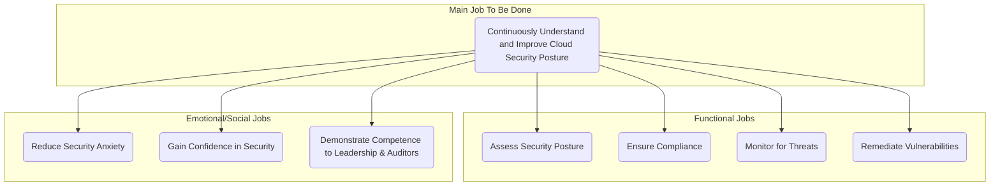
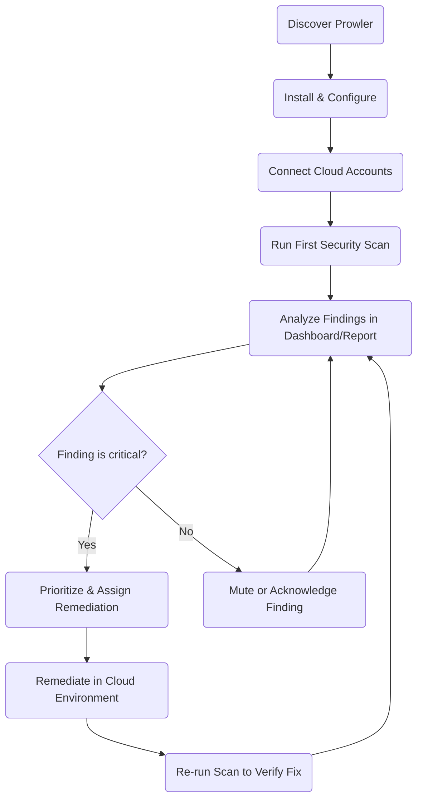
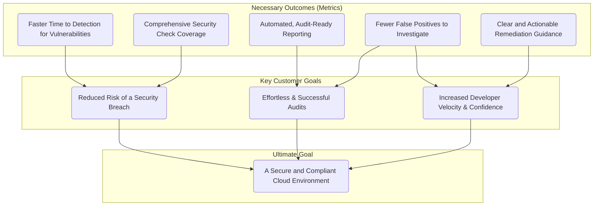

# Jobs to be Done (JTBD) Documentation for Prowler

## 1. Core Job Definition

The primary job that customers "hire" Prowler to do is to gain a clear, comprehensive, and continuous understanding of their cloud security and compliance posture.

> **When** I am responsible for my organization's cloud infrastructure, **I want to** proactively identify, understand, and report on security risks and compliance gaps, **so I can** effectively mitigate threats, pass audits, and prevent security incidents.

This core job revolves around moving from a state of uncertainty and potential risk to a state of confidence and control over the cloud environment.

## 2. Job Map

This diagram illustrates the main job and the surrounding functional and emotional jobs that customers are trying to accomplish.

## 3. Related Jobs

### Supporting Jobs
These are the smaller, tactical tasks that need to be done to achieve the core job. Prowler is hired to handle these tasks efficiently.

- **Run security assessments:** Execute scans across multiple cloud providers (AWS, Azure, GCP, etc.) and accounts to find misconfigurations.
- **Check for compliance:** Validate the cloud environment against hundreds of controls from frameworks like CIS, NIST, GDPR, and HIPAA.
- **Visualize findings:** See a high-level overview of the security posture through a dashboard or detailed reports.
- **Generate reports:** Create audit-ready compliance reports and evidence.
- **Integrate into pipelines:** Embed security checks into the CI/CD process to catch issues before they reach production ("shift-left").
- **Manage findings:** Triage, prioritize, and mute findings to focus on what matters most.

### Complementary Jobs
These are jobs that are often done in conjunction with using Prowler.

- **User and access management:** Onboard team members (Security, DevOps) and assign roles and permissions within the Prowler App.
- **Workflow integration:** Connect Prowler to other tools like Jira or Slack to create tickets and send notifications based on findings.

## 4. Customer Journey and Desired Outcomes

This diagram shows the typical steps a customer takes to get their job done with Prowler, along with the desired outcomes at each stage.

### Progress Diagram

### Desired Outcomes
These are the measurable results customers expect from "hiring" Prowler.

| Desired Outcome | Metric / Indicator of Success |
| :--- | :--- |
| **Minimize time to value** | - Set up and run the first scan in **under 15 minutes**. |
| **Increase operational efficiency** | - Reduce the time spent manually checking for cloud misconfigurations by **>90%**.   - Automate the generation of compliance evidence, saving hours of manual work per audit. |
| **Improve security posture** | - Decrease the time to detect critical vulnerabilities from days/weeks to **minutes**.   - Increase the coverage of security checks across all cloud assets to **over 95%**. |
| **Enhance clarity and actionability** | - Reduce the time needed to understand the impact and remediation steps for a finding.   - Decrease the number of false positive findings that require investigation. |
| **Improve cross-team collaboration** | - Provide a single, shared view of security posture for Security, DevOps, and Compliance teams. |

## 5. Outcome Hierarchy

This diagram shows how the lower-level metrics and desired outcomes contribute to the ultimate high-level goals of the customer.

