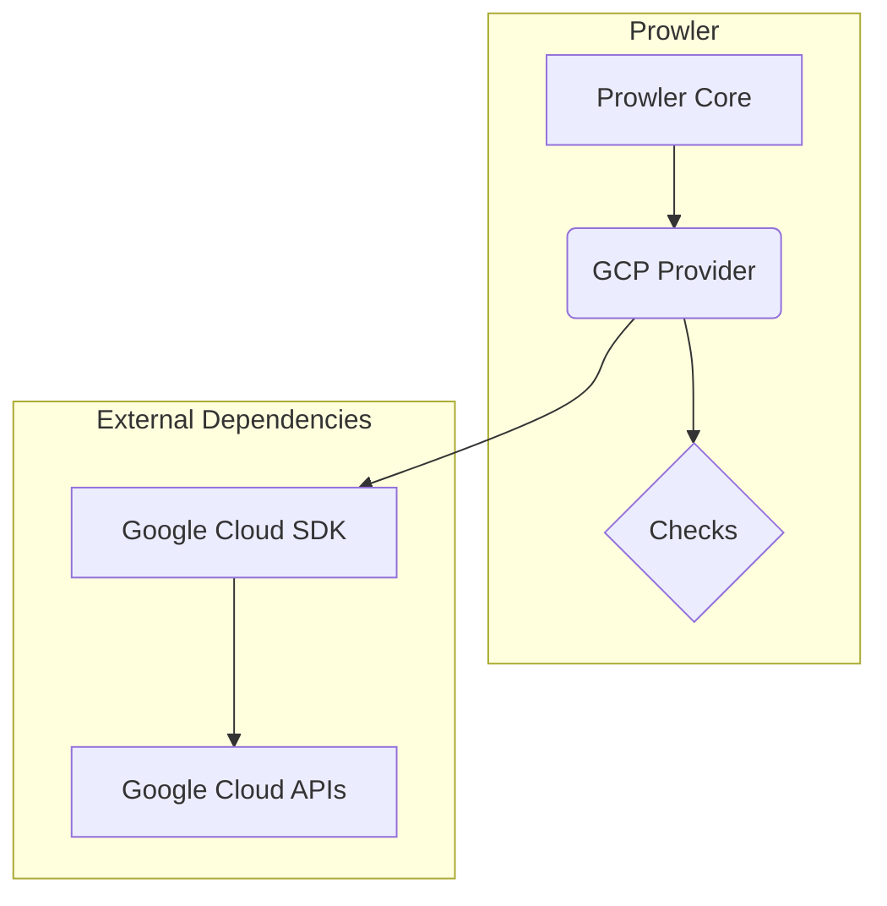
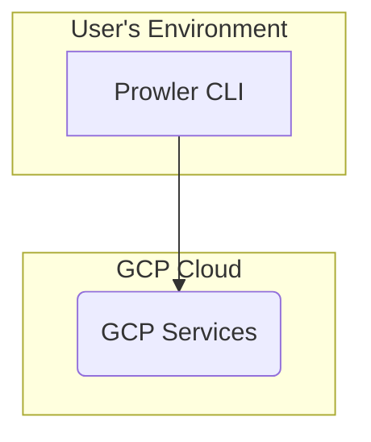
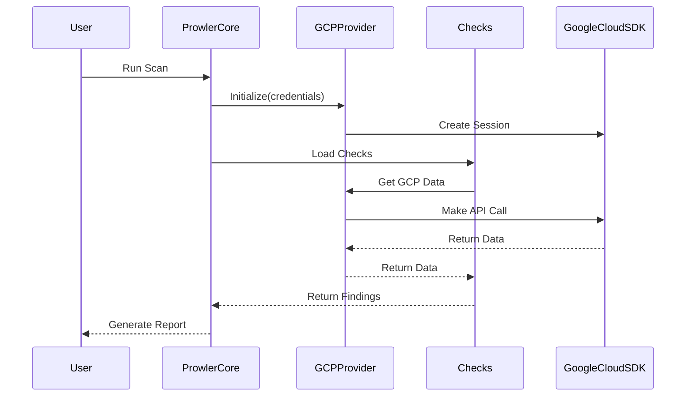
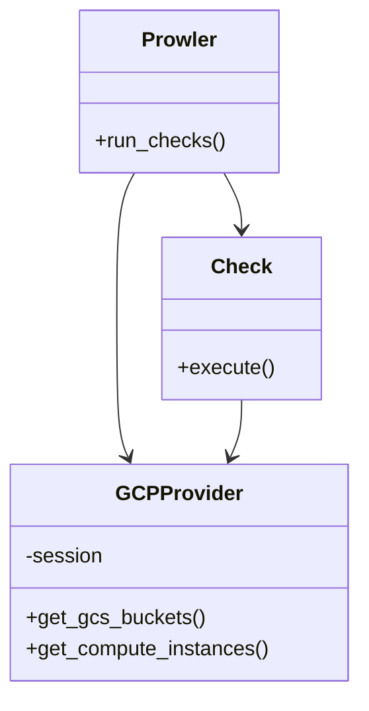

# Prowler GCP SDK Integration Architecture

## Architecture Overview

Prowler's integration with the GCP SDK follows a layered architecture, consistent with its overall design. This modular approach enhances maintainability and extensibility.

*   **Prowler Core:** The central engine that drives the scanning process, including loading checks, managing GCP sessions, and generating reports.
*   **GCP Provider:** This component acts as an abstraction layer for the Google Cloud SDK, providing a standardized interface for Prowler Core to interact with various GCP services.
*   **Checks:** Individual modules that contain the logic for specific security checks. They utilize the GCP Provider to retrieve necessary data from the GCP environment.
*   **Google Cloud SDK:** The underlying library used to communicate with Google Cloud APIs.

## Use Cases

### 1. Run a Security Scan on a GCP Project

*   **User Interaction:** The user executes the Prowler CLI, specifying the GCP project and the checks to be performed.
*   **System Process:**
    1.  Prowler Core initializes the GCP Provider with the specified credentials.
    2.  The GCP Provider establishes a session with GCP using the Google Cloud SDK.
    3.  Prowler Core loads the relevant checks.
    4.  Each check leverages the GCP Provider to make the necessary API calls to GCP.
    5.  The findings are aggregated and formatted into a comprehensive report.
*   **Expected Outcome:** A report detailing the security findings of the scan.

### 2. Check for a Specific GCP Security Configuration

*   **User Interaction:** A developer needs to verify a particular configuration, such as ensuring that GCS buckets are not publicly accessible.
*   **System Process:**
    1.  The developer runs the specific Prowler check for GCS public access.
    2.  The check communicates with the GCP Provider to list all GCS buckets and their public access status.
    3.  The result is returned to the developer.
*   **Expected Outcome:** A list of GCS buckets that are publicly accessible.

## System Diagrams

### Component Diagram

### Deployment Diagram

### Sequence Diagram: Running a Scan

### Class Diagram

## Technology Stack

*   **Programming Language:** Python
*   **GCP SDK:** google-api-python-client
*   **CLI Framework:** argparse
*   **Configuration:** YAML

## Key Design Decisions

*   **Layered Architecture:** This design decouples the core logic from the cloud provider-specific implementation, facilitating the future addition of other cloud providers.
*   **Provider-Based Model:** A dedicated `GCPProvider` encapsulates all interactions with GCP APIs, offering a clean and consistent interface to the rest of the application.
*   **Stateless Checks:** Each check is designed to be stateless, enabling them to be run in parallel and independently of one another.
