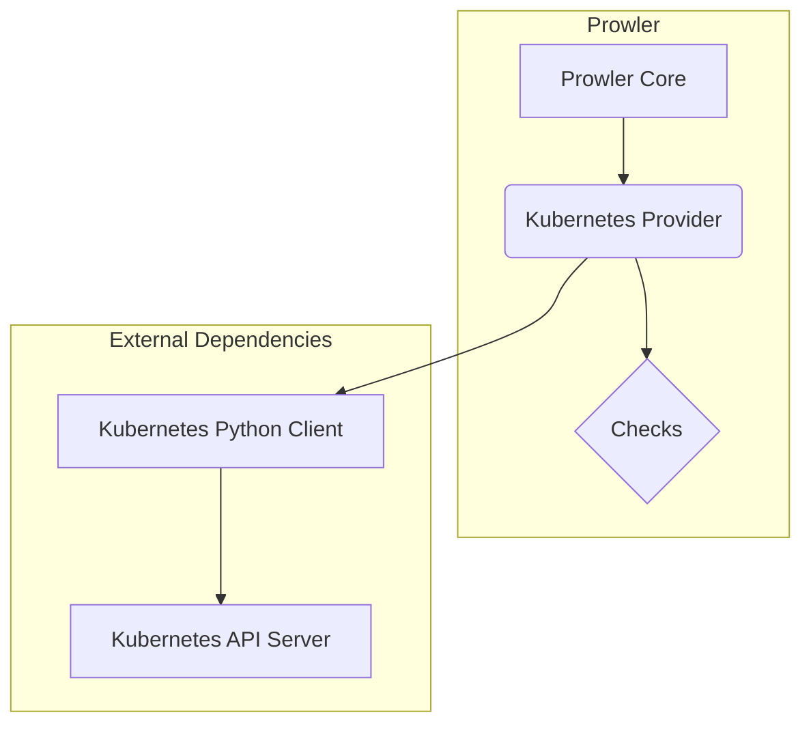
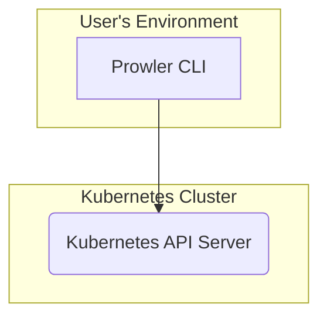
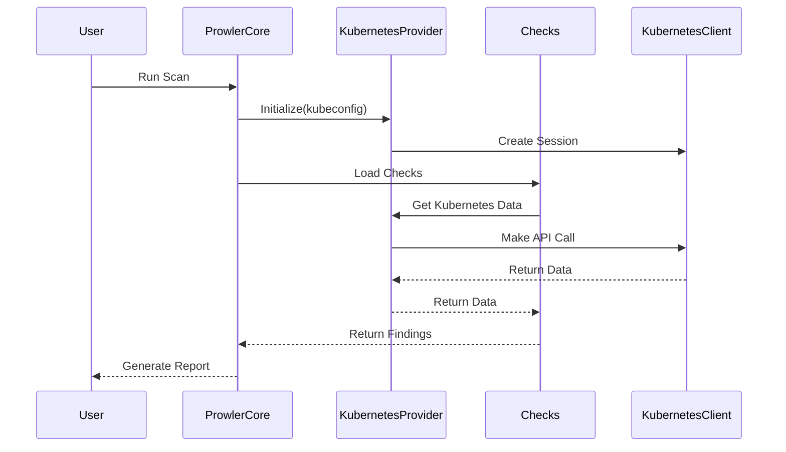
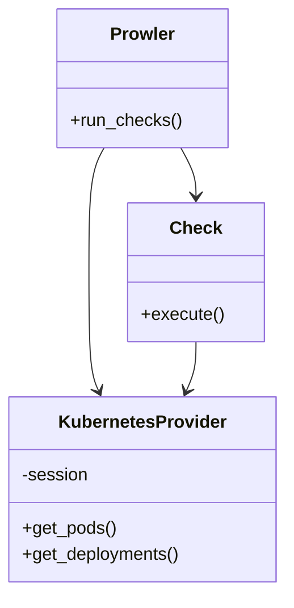

# Prowler Kubernetes Integration Architecture

## Architecture Overview

Prowler's integration with Kubernetes is designed using a layered architecture to ensure a clear separation of concerns and promote modularity. This makes the system easier to maintain and extend. The key components are:

*   **Prowler Core:** The central component that orchestrates the scanning process. It is responsible for loading checks, managing Kubernetes sessions, and generating reports.
*   **Kubernetes Provider:** This component acts as an abstraction layer for the Kubernetes Python Client, providing a unified interface for the Prowler Core to interact with the Kubernetes API.
*   **Checks:** These are individual modules containing the logic for specific security checks. They use the Kubernetes Provider to gather the necessary information from the Kubernetes cluster.
*   **Kubernetes Python Client:** The underlying library used to communicate with the Kubernetes API.

## Use Cases

### 1. Run a Security Scan on a Kubernetes Cluster

*   **User Interaction:** The user runs the Prowler CLI, providing the path to the kubeconfig file or running it from within the cluster.
*   **System Process:**
    1.  Prowler Core initializes the Kubernetes Provider with the specified configuration.
    2.  The Kubernetes Provider establishes a session with the Kubernetes API server using the Kubernetes Python Client.
    3.  Prowler Core loads the requested checks.
    4.  Each check uses the Kubernetes Provider to make the necessary API calls to the Kubernetes API.
    5.  The results are collected and formatted into a report.
*   **Expected Outcome:** A report is generated with the findings of the security scan.

### 2. Check for a Specific Kubernetes Security Configuration

*   **User Interaction:** A developer wants to verify a specific configuration, such as ensuring that no containers are running in privileged mode.
*   **System Process:**
    1.  The developer runs a specific Prowler check.
    2.  The check interacts with the Kubernetes Provider to list all pods and their security context.
    3.  The result is returned to the developer.
*   **Expected Outcome:** A list of pods running in privileged mode.

## System Diagrams

### Component Diagram

### Deployment Diagram

### Sequence Diagram: Running a Scan

### Class Diagram

## Technology Stack

*   **Programming Language:** Python
*   **Kubernetes Client:** Kubernetes Python Client
*   **CLI Framework:** argparse
*   **Configuration:** YAML

## Key Design Decisions

*   **Layered Architecture:** This was chosen to decouple the core logic from the specific implementation for Kubernetes. This makes it easier to maintain and extend.
*   **Provider-Based Model:** The use of a dedicated `KubernetesProvider` encapsulates all interactions with the Kubernetes API, providing a clean and consistent interface for the rest of the application.
*   **Stateless Checks:** Each check is designed to be stateless, which allows them to be run in parallel and independently of each other.
