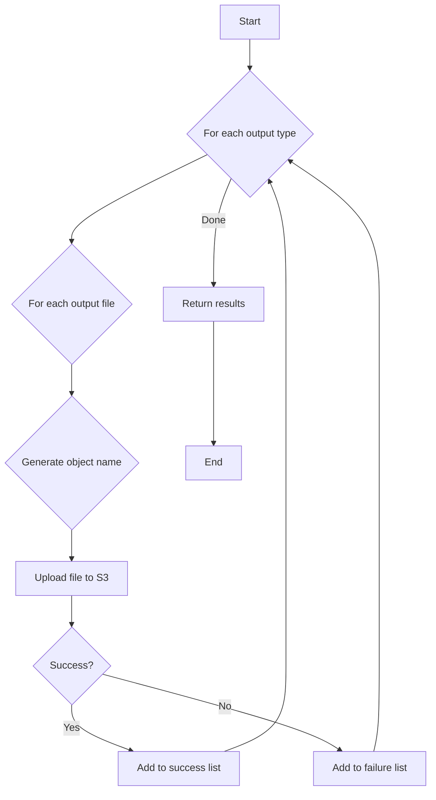

# S3 Library Documentation

## File Overview

This file provides a Python class `S3` for interacting with Amazon S3. It includes methods for sending output files to an S3 bucket and for testing the connection to an S3 bucket. The class handles AWS session management, including assuming roles and handling various AWS-related exceptions.

## Class/Function Descriptions

### `class S3`

-   **Description**: A class representing an S3 bucket, with methods to upload files and test the connection.
-   **Dependencies**: `boto3`, `prowler.lib.logger`, `prowler.lib.outputs.output`, `prowler.providers.aws.aws_provider`

#### `__init__(self, ...)`

-   **Description**: Initializes the `S3` object.
-   **Parameters**:
    -   `bucket_name` (str): The name of the S3 bucket.
    -   `output_directory` (str): The path to the output directory.
    -   `session` (AWSSession, optional): An existing AWS session. If not provided, a new session will be created.
    -   `role_arn` (str, optional): The ARN of the IAM role to assume.
    -   `session_duration` (int, optional): The duration of the session in seconds.
    -   `external_id` (str, optional): The external ID for role assumption.
    -   `role_session_name` (str, optional): The name of the role session.
    -   `mfa` (bool, optional): Whether MFA is enabled.
    -   `profile` (str, optional): The AWS CLI profile to use.
    -   `aws_access_key_id` (str, optional): The AWS access key ID.
    -   `aws_secret_access_key` (str, optional): The AWS secret access key.
    -   `aws_session_token` (str, optional): The AWS session token.
    -   `retries_max_attempts` (int, optional): The maximum number of retries for the AWS client.
    -   `regions` (set, optional): A set of regions to audit.

#### `get_object_path(output_directory: str) -> str`

-   **Description**: Returns the object path within the S3 bucket, removing `prowler/` from the path if present.
-   **Parameters**:
    -   `output_directory` (str): The output directory path.
-   **Returns**: `str` - The object path within the S3 bucket.

#### `generate_subfolder_name_by_extension(extension: str) -> str`

-   **Description**: Generates a subfolder name based on the file extension.
-   **Parameters**:
    -   `extension` (str): The file extension.
-   **Returns**: `str` - The subfolder name.

#### `send_to_bucket(self, outputs: dict[str, list[Output]]) -> dict[str, dict[str, list[str]]]`

-   **Description**: Uploads output files to the S3 bucket.
-   **Parameters**:
    -   `outputs` (dict): A dictionary of output files to upload.
-   **Returns**: `dict` - A dictionary containing the upload status of the files.

#### `test_connection(...) -> Connection`

-   **Description**: Tests the connection to the S3 bucket by uploading and then deleting a test file.
-   **Parameters**: Same as `__init__`.
-   **Returns**: `Connection` - A `Connection` object indicating the status of the connection test.

## Use Cases (Relevant to the File)

-   **Storing Scan Results**: The `S3` class is used to upload Prowler scan results to an S3 bucket for storage and later analysis.
-   **Verifying S3 Connectivity**: The `test_connection` method is used to verify that Prowler can connect to and perform operations on a given S3 bucket.

## System Diagrams

### `send_to_bucket` Flowchart

