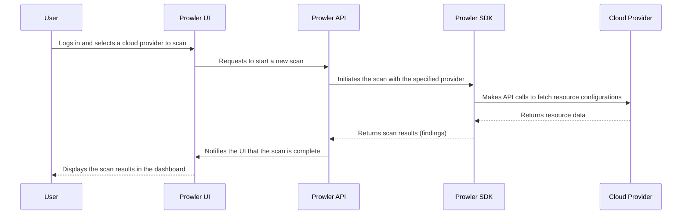

# Prowler Technical Architecture

## 1. Architecture Overview

Prowler is an open-source cloud security platform with a modular architecture designed for flexibility and scalability. It consists of two main products: the **Prowler App** and the **Prowler CLI**.

The overall architecture can be described as a layered architecture, with distinct components for the presentation layer, application layer, and data layer.

-   **Prowler App**: A web-based application that provides a user-friendly interface for running security scans and visualizing the results.
    -   **Prowler UI**: The frontend of the Prowler App, built with Next.js. It communicates with the Prowler API to initiate scans and display results.
    -   **Prowler API**: The backend of the Prowler App, built with Django REST Framework. It is responsible for orchestrating security scans, storing the results, and exposing an API for the UI.
    -   **Database**: Prowler uses PostgreSQL to store scan results, user data, and other application state. Valkey is used for caching and as a message broker for background tasks.
-   **Prowler CLI**: A command-line interface that allows users to run security scans directly from their terminal. It is built in Python and can be installed as a pip package or run from a Docker container.
-   **Prowler SDK**: A Python SDK that provides the core functionality for running scans and can be used to extend the Prowler CLI.

```mermaid
graph TD
    subgraph Prowler App
        UI[Prowler UI <br>(Next.js)]
        API[Prowler API <br>(Django)]
        DB[(Database <br>PostgreSQL/Valkey)]
    end

    subgraph Prowler CLI
        CLI[Prowler CLI <br>(Python)]
    end

    SDK[Prowler SDK <br>(Python)]

    UI -- REST API --> API
    API -- Scans --> SDK
    API -- Stores data --> DB
    CLI -- Uses --> SDK

    style UI fill:#f9f,stroke:#333,stroke-width:2px
    style API fill:#ccf,stroke:#333,stroke-width:2px
    style DB fill:#fca,stroke:#333,stroke-width:2px
    style CLI fill:#cfc,stroke:#333,stroke-width:2px
    style SDK fill:#cff,stroke:#333,stroke-width:2px
```

## 2. Use Cases

Prowler supports a variety of use cases for cloud security and compliance:

-   **Security Auditing**: Perform comprehensive security assessments of cloud environments to identify misconfigurations and vulnerabilities.
-   **Continuous Monitoring**: Schedule regular scans to continuously monitor the security posture of your cloud infrastructure.
-   **Compliance-as-Code**: Enforce compliance with industry standards and regulatory frameworks by integrating Prowler into your CI/CD pipeline.
-   **Incident Response**: Quickly assess the security state of your cloud environment in response to a security incident.
-   **System Hardening**: Use Prowler's checks to harden your cloud resources and reduce your attack surface.

### Use Case: Running a Security Scan with the Prowler App



## 3. System Diagrams

### Component Diagram

```mermaid
componentDiagram
    [Prowler UI] --|> [Prowler API] : REST API
    [Prowler API] --|> [Prowler SDK] : Python API
    [Prowler API] --|> [Database] : Stores/retrieves data
    [Prowler CLI] --|> [Prowler SDK] : Python API
```

### Deployment Diagram

```mermaid
deploymentDiagram
    node "User's Workstation" {
        [Prowler CLI]
        [Browser] --> [Prowler App]
    }

    node "Cloud Environment" {
        frame "Docker Compose" {
            [Prowler App]
        }
    }
```

## 4. Technology Stack

-   **Programming Languages**: Python, JavaScript/TypeScript
-   **Backend Framework**: Django REST Framework
-   **Frontend Framework**: Next.js
-   **Databases**: PostgreSQL, Valkey
-   **Containerization**: Docker
-   **Infrastructure as Code (IaC) Scanning**: Trivy
-   **Large Language Model (LLM) Scanning**: Promptfoo

## 5. Key Design Decisions

-   **Open-Source**: Prowler is open-source to foster community collaboration and transparency.
-   **Multi-Cloud Support**: Designed to be a single tool for security assessments across multiple cloud providers.
-   **Compliance as Code**: Prowler's extensive library of checks mapped to compliance frameworks allows organizations to integrate security and compliance into their development lifecycle.
-   **Extensibility**: The Prowler SDK enables developers to create custom checks and extend the tool's functionality.
-   **Web-Based UI**: The Prowler App provides a user-friendly interface that makes the tool accessible to a broader audience.
