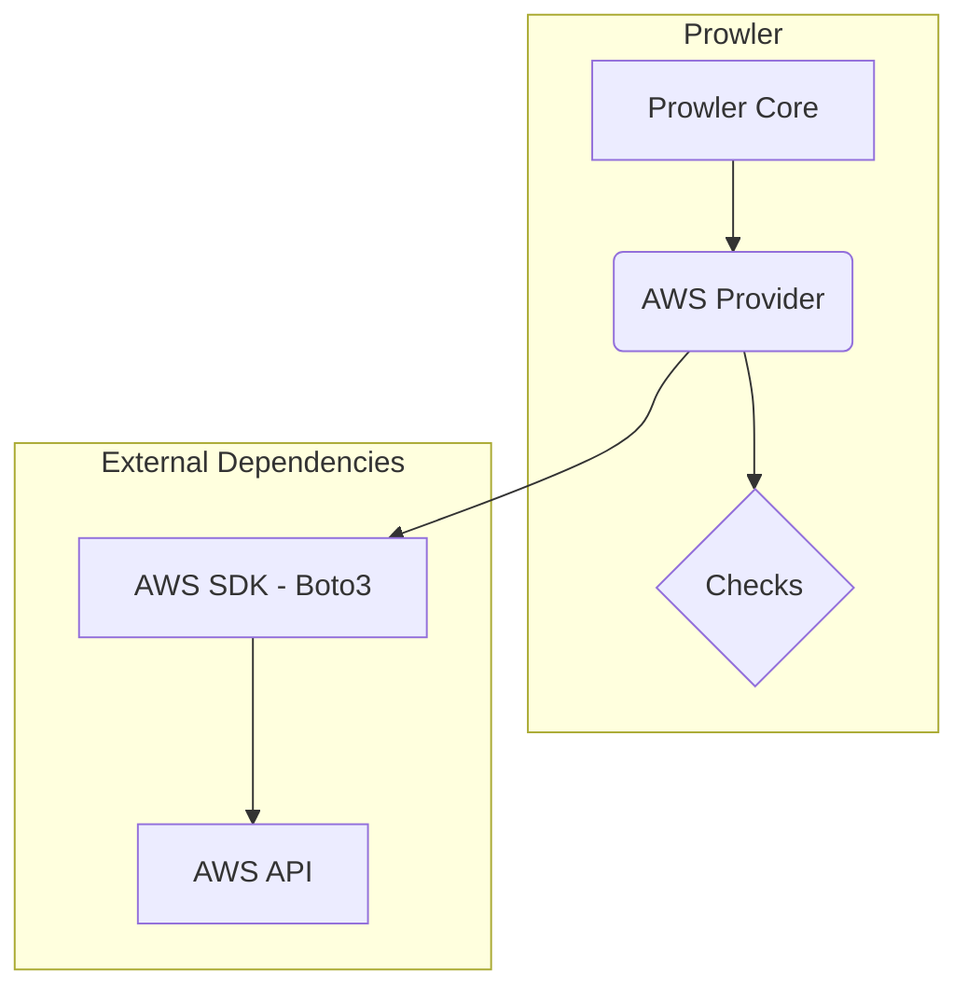
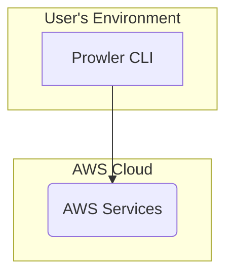
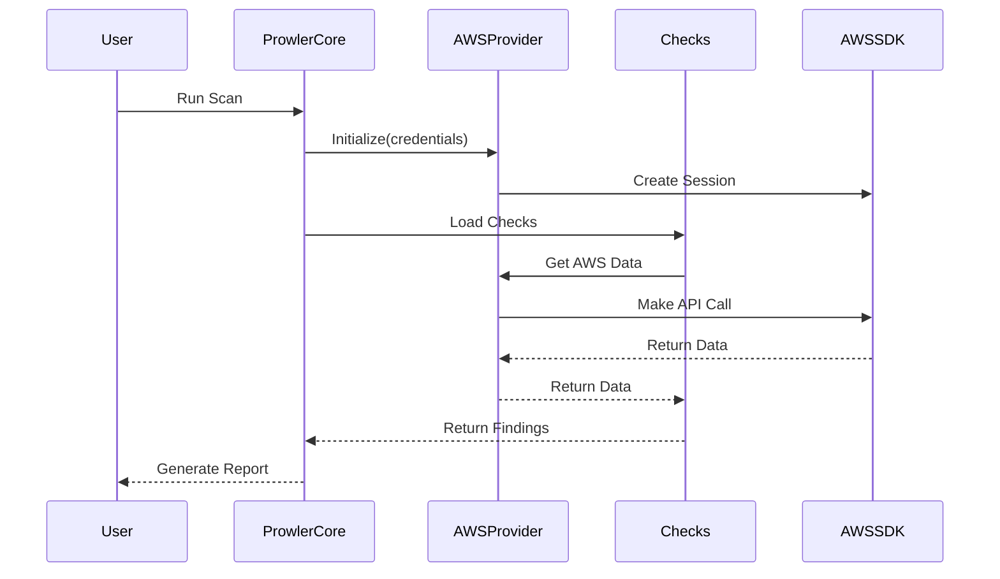
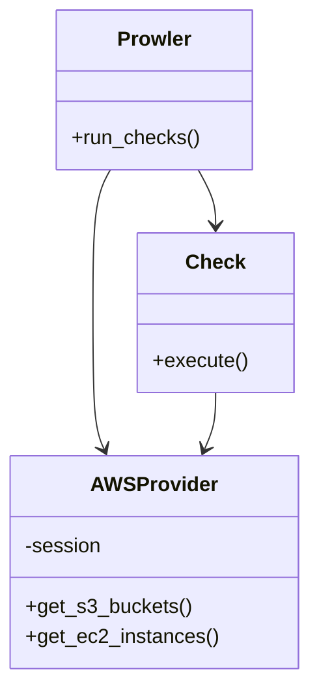

# Prowler AWS SDK Integration Architecture

## Architecture Overview

Prowler's integration with the AWS SDK is designed as a layered architecture. This allows for a clear separation of concerns and promotes modularity, making it easier to maintain and extend. The key components are:

*   **Prowler Core:** The central component that orchestrates the scanning process. It loads the checks, manages the AWS sessions, and generates the reports.
*   **AWS Provider:** This component is responsible for interacting with the AWS API using the AWS SDK (Boto3). It provides a unified interface for the Prowler Core to access different AWS services.
*   **Checks:** These are individual modules that contain the logic for a specific security check. They use the AWS Provider to gather the necessary information from the AWS environment.
*   **AWS SDK (Boto3):** The underlying library used to communicate with the AWS API.

## Use Cases

### 1. Run a Security Scan on an AWS Account

*   **User Interaction:** The user runs the Prowler CLI, specifying the AWS profile and the checks to be executed.
*   **System Process:**
    1.  Prowler Core initializes the AWS Provider with the specified credentials.
    2.  The AWS Provider establishes a session with AWS using Boto3.
    3.  Prowler Core loads the requested checks.
    4.  Each check uses the AWS Provider to make the necessary API calls to AWS.
    5.  The results are collected and formatted into a report.
*   **Expected Outcome:** A report is generated with the findings of the security scan.

### 2. Check for a Specific AWS Security Configuration

*   **User Interaction:** A developer wants to verify a specific configuration, like checking if S3 buckets are encrypted.
*   **System Process:**
    1.  The developer runs a specific Prowler check.
    2.  The check interacts with the AWS Provider to list all S3 buckets and their encryption status.
    3.  The result is returned to the developer.
*   **Expected Outcome:** A list of S3 buckets that do not have encryption enabled.

## System Diagrams

### Component Diagram

### Deployment Diagram

### Sequence Diagram: Running a Scan

### Class Diagram

## Technology Stack

*   **Programming Language:** Python
*   **AWS SDK:** Boto3
*   **CLI Framework:** argparse
*   **Configuration:** YAML

## Key Design Decisions

*   **Layered Architecture:** This was chosen to decouple the core logic from the cloud provider-specific implementation. This makes it easier to add support for other cloud providers in the future.
*   **Provider-Based Model:** The use of a dedicated `AWSProvider` encapsulates all interactions with the AWS API, providing a clean and consistent interface for the rest of the application.
*   **Stateless Checks:** Each check is designed to be stateless, which allows them to be run in parallel and independently of each other.
