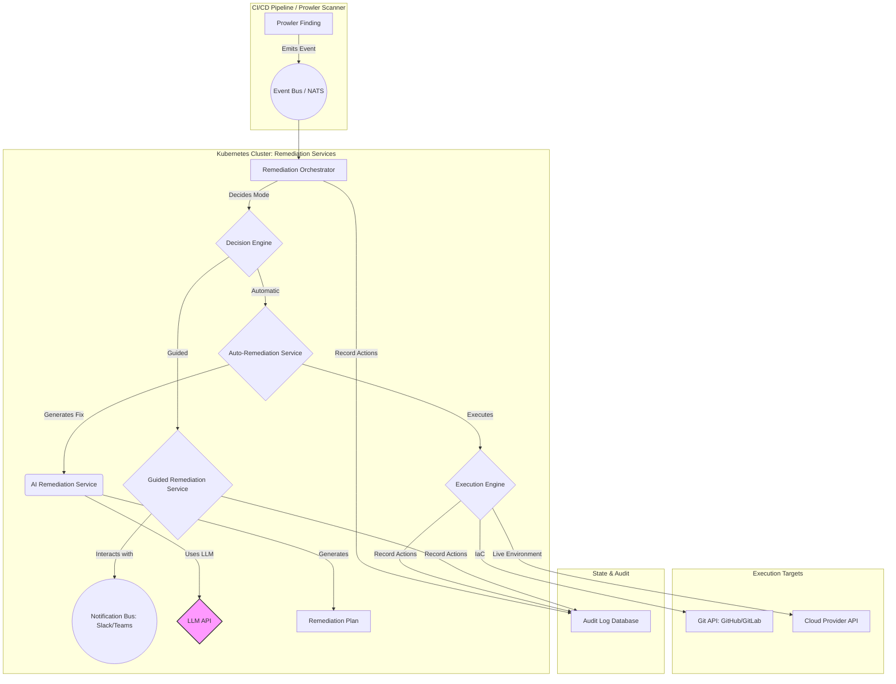

# Technical Requirements: AI-Powered Auto-Remediation and Guided Remediation

**Author:** Angel

This document details the technical requirements for the "AI-Powered Auto-Remediation and Guided Remediation" initiative. This feature will be a core component of the Prowler platform, transforming it from a detection tool into a proactive security solution.

---

## Executive Summary

**Purpose:** The objective is to create a system that can automatically fix security misconfigurations detected by Prowler or guide users through the remediation process. By leveraging Large Language Models (LLMs), the system will intelligently generate Infrastructure as Code (IaC) patches or sequences of CLI commands to resolve vulnerabilities.

**Strategic Value:** This initiative will dramatically reduce the Mean Time to Remediate (MTTR), improve the overall security posture, and significantly decrease the manual workload on security and development teams. It shifts Prowler from a passive observer to an active participant in the security lifecycle.

**Audience:** This document is intended for project stakeholders, product managers, and the engineering teams responsible for designing, building, and maintaining the Prowler platform.

## Target Architecture & System Diagram Description

The architecture is designed as a set of event-driven microservices running on Kubernetes, ensuring scalability, resilience, and a clean separation of concerns. The core technology stack includes Go for high-performance services, Kubernetes for orchestration, and an event bus like NATS for asynchronous communication.

### System Diagram Flow Description

1.  **Trigger:** A **Prowler Finding** is identified during a scan. An event payload containing the finding details (check ID, resource, severity, file path for IaC) is published to the central **Event Bus (NATS)**.

2.  **Orchestration:** The **Remediation Orchestrator**, a Go-based microservice, consumes the event. It queries its configuration to determine the remediation mode for this type of finding (e.g., `automatic`, `guided`, or `manual`).

3.  **Decision & Routing:** 
    *   If `guided`, the orchestrator forwards the event to the **Guided Remediation Service**. This service sends an interactive message to the user via the **Notification Bus** (e.g., Slack), presenting the finding and asking for approval to proceed.
    *   If `automatic`, the event is passed to the **Auto-Remediation Service**.

4.  **AI-Powered Generation:** The **Auto-Remediation Service** contacts the **AI Remediation Service**. This core service constructs a detailed prompt for the **LLM API**, including the finding details, the vulnerable IaC snippet, and contextual examples of correct code. The LLM returns a structured **Remediation Plan** (e.g., a code diff for an IaC file or a series of `aws cli` commands).

5.  **Execution:** The Auto-Remediation Service passes the validated plan to the **Execution Engine**. This engine is responsible for interacting with external systems.
    *   For an IaC fix, it uses the **Git API** to create a new branch and open a pull request with the suggested code changes.
    *   For a live environment fix, it uses the appropriate **Cloud Provider API** to execute the necessary changes.

6.  **Auditing:** Every significant action—from the initial event to the final execution—is recorded in a central **Audit Log Database** to provide a complete, immutable trail of all automated changes.

## Key Use Cases

1.  **Automated IaC Pull Request Generation:** A developer commits a Terraform file to a feature branch that creates an S3 bucket without encryption. The CI pipeline runs Prowler, which generates a finding. The system automatically creates a pull request on the same feature branch that adds the required encryption configuration, tagging the original developer for review.

2.  **Real-time Guided Remediation for Critical Findings:** Prowler, running in a continuous monitoring mode, detects that a production security group has been modified to allow unrestricted SSH access (0.0.0.0/0). Within seconds, a high-priority alert is sent to the on-call security engineer's Slack channel with "Deny" and "Approve Fix" buttons. Clicking "Approve Fix" triggers the Execution Engine to immediately remove the dangerous rule.

3.  **Integration with External Ticketing Systems:** A scheduled Prowler scan finds a non-critical compliance issue (e.g., a missing resource tag). The Remediation Orchestrator is configured to handle this by creating a ticket in Jira. The ticket is automatically populated with the finding details and a link to the Prowler console where a guided fix can be initiated by the assigned developer.

## Return on Investment (ROI) Justification

*   **Cost Optimization:**
    *   **Reduced Operational Expense:** Automating the remediation of the top 20 most common findings could save an estimated 20-30 engineering hours per week for a medium-sized organization, drastically reducing operational overhead.
    *   **Lower TCO:** By embedding remediation into the platform, we reduce the need for separate, expensive SOAR (Security Orchestration, Automation, and Response) solutions.

*   **Business Value/Risk Improvement:**
    *   **Drastic Risk Reduction:** The time a critical vulnerability remains open in production (window of exposure) can be reduced from days or hours to minutes or seconds, significantly lowering the risk of a breach.
    *   **Improved Reliability & Consistency:** Automated remediation eliminates the risk of human error during manual fixes, ensuring that changes are applied consistently and correctly every time.
    *   **Accelerated Feature Delivery:** Developers spend less time on security bug fixes and more time building value-add features. Security team reviews are streamlined as many issues are fixed before they reach the review stage.

## Non-Functional Technical Requirements

1.  **Scalability:** The system must be capable of processing up to 1,000 finding events per minute during peak loads, with Kubernetes Horizontal Pod Autoscalers configured for all remediation microservices.

2.  **Latency:** The end-to-end latency for an `automatic` IaC pull request generation must be under 90 seconds from the initial finding.

3.  **Security:** All secrets (LLM API keys, Git tokens, Cloud Provider credentials) must be stored and managed in a central secret store like HashiCorp Vault or AWS Secrets Manager. Prompts sent to the LLM must be sanitized to remove sensitive data.

4.  **Operational Resilience (SLO):** The Remediation Orchestrator service will have an availability SLO of 99.9%. The end-to-end success rate of fully automated remediation actions for supported checks will have an SLI of >95%.

5.  **Auditability:** Every remediation plan generation and execution attempt must be logged in an immutable audit database. Logs must contain the original finding, the generated plan, the execution result (success/failure), and the user who approved it (for guided flows).

6.  **Idempotency:** All remediation actions executed by the Execution Engine must be idempotent. Applying the same fix to an already-remediated resource should result in a "no-op" success state, not an error or a duplicate change.

7.  **Configurability:** The system must provide a flexible configuration interface where users can define the remediation mode (`automatic`, `guided`, `manual`) on a granular basis (e.g., per-check, per-environment, per-severity).
