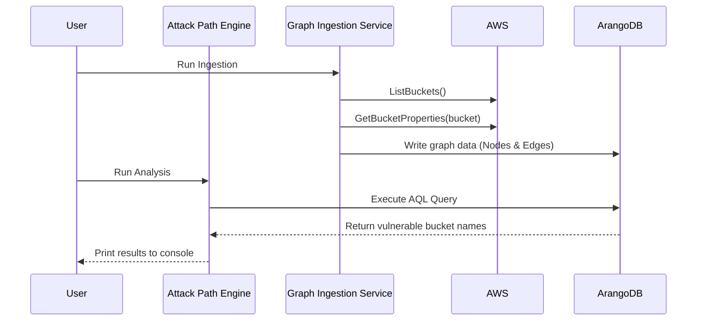

# Technical Requirements: Dynamic Risk Graph PoC

**Author:** 10x Architect
**Audience:** This document is intended for the engineering team responsible for building the PoC, as well as for architects and product managers who need to understand the technical implementation details of Phase 1.

## 1. Introduction

This document provides the detailed technical requirements for Phase 1 of the 10x Prowler Proof of Concept, as outlined in the main `poc.md` file. The objective of this phase is to validate the foundational hypothesis: that we can model a cloud environment as a graph and query it to find a specific, high-risk attack path.

---

## 2. Use Cases

### Primary Use Case: Detecting a Toxic Combination

- **Actor:** Alex, the Security Engineer.
- **Scenario:** Alex has an AWS account with dozens of S3 buckets. One of these buckets, `corp-financials-q3`, was accidentally made public and is also tagged with `sensitivity: high`.
- **Workflow:**
    1. Alex executes the PoC system.
    2. The **Graph Ingestor** scans the AWS account, models the S3 buckets and their properties as a graph in ArangoDB.
    3. The **Attack Path Engine** runs its query against the graph.
    4. The system outputs the name `corp-financials-q3`, immediately alerting Alex to the critical risk.

---

## 3. System Architecture & Diagram

The architecture for this PoC is designed for simplicity and local execution. It consists of two core microservices and a database, all managed by Docker Compose.

- **Graph Ingestion Service (`ingestor`):** A Go service responsible for fetching data from AWS and loading it into the graph.
- **Attack Path Engine (`engine`):** A Go service that queries the graph to find vulnerabilities.
- **Graph Database (`arangodb`):** A local ArangoDB instance for storing the environment model.

### System Diagram (Sequence of Operations)



---

## 4. Functional Requirements

| Requirement | Input | Process | Output |
| :--- | :--- | :--- | :--- |
| **Ingest AWS S3 Data** | AWS Credentials with `s3:ListAllMyBuckets`, `s3:GetBucketTagging`, `s3:GetBucketPublicAccessBlock` permissions. | The Ingestor service scans all S3 buckets, fetches their tags and public access block status, and transforms this data into a graph model. | Documents and edges representing the S3 buckets and their properties are created in the ArangoDB database. |
| **Detect Toxic Combination** | A hardcoded AQL query. | The Attack Path Engine executes the query against the graph database to find documents that match a specific pattern. | A list of bucket names that are identified as being both public and tagged as sensitive. |

---

## 5. Non-Functional Requirements

- **Technology Stack:**
  - **Services:** Go
  - **Database:** ArangoDB (running in a local Docker container)
  - **Cloud Interaction:** AWS Go SDK v2
- **Scope & Limitations:**
  - The PoC is strictly limited to **AWS S3 Buckets**.
  - Only two properties will be modeled: **Public Access Block status** and **Resource Tags**.
  - All other resource types, properties, and relationships are out of scope.
- **Environment:**
  - The entire system must be defined in a `docker-compose.yml` file for easy, one-command setup.
  - The system will connect to a live AWS account and must only use read-only credentials.
- **Performance:**
  - **Ingestion:** Time-to-ingest for 1,000 buckets should be under 5 minutes.
  - **Querying:** The attack path query should complete in **under 60 seconds** for the same data set.
- **Data Integrity:**
  - The ingestion process must be **idempotent**. Running the ingestor multiple times should not create duplicate nodes or edges in the graph.
- **Code Quality & Maintainability:**
  - Code should be well-documented, especially the logic for data transformation and the AQL query.
  - The project structure within `_poc/` must remain clean and self-contained.

---

## 6. Detailed Component Architecture

### 6.1. Graph Ingestion Service (`_poc/ingestor/`)

- **Responsibility:** Acts as the ETL (Extract, Transform, Load) pipeline for the graph.
- **Logic:**
  1.  Initialize a connection to the AWS API and the ArangoDB database.
  2.  Use `UPSERT` operations in AQL to ensure idempotency.
  3.  Execute the `ListBuckets` API call.
  4.  For each bucket:
      a. `UPSERT` a primary `S3Bucket` document.
      b. Execute `GetBucketPublicAccessBlock`. If public, `UPSERT` an `is_public` edge to a shared `Public` document.
      c. Execute `GetBucketTagging`. For each tag, `UPSERT` a `Tag` document and an associated `has_tag` edge.

### 6.2. Attack Path Engine (`_poc/engine/`)

- **Responsibility:** Contains the core analysis logic for finding vulnerabilities.
- **Logic:**
  1.  Initialize a connection to the ArangoDB database.
  2.  Execute the following hardcoded AQL query:
      ```aql
      FOR b IN S3Bucket
          FILTER b.is_public == true
          FOR v_tag, e_tag IN 1..1 OUTBOUND b has_tag
              FILTER v_tag.key == 'sensitivity' AND v_tag.value == 'high'
              RETURN b.name
      ```
  3.  Print the returned bucket names to standard output.

---

## 7. Success Criteria

This phase will be considered a success when:

1.  The Ingestion Service runs without errors and populates a local ArangoDB database idempotently.
2.  The Attack Path Engine correctly identifies and prints the name of any S3 bucket that is both public and tagged with `sensitivity: high`.
3.  The entire PoC can be started with a single `docker-compose up` command.
