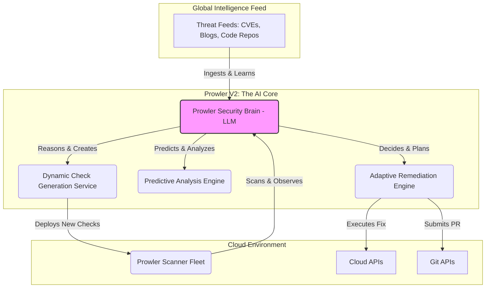

# Strategic White Paper: Prowler V2 - The Autonomous Security Platform

**Author:** Chief Innovation Officer & Principal Architect

---

## 1. Disruptive Vision & The 'Game Changer'

Prowler V1 established itself as a market leader in cloud security auditing. However, the current paradigm of security—human-driven scanning and reactive remediation—is fundamentally an arms race we cannot win. The speed and complexity of modern cloud environments have outpaced human capacity. Incremental improvements are no longer sufficient.

Prowler V2 will pivot from being a best-in-class *tool* to a first-of-its-kind **Autonomous Security Platform**. This is not an evolution; it is a redefinition of our role in the security ecosystem.

**The Emerging Technology: Generative AI as a Sovereign Security Analyst**

The core of Prowler V2 will be a specialized, self-improving security-focused Large Language Model (LLM)—the **Prowler Security Brain**. This AI will not merely assist human analysts; it will become the primary analyst, capable of reasoning, learning, and acting independently.

**The 'Game Changer': Predictive, Self-Healing Cloud Security**

The new, previously impossible business capability is **proactive and autonomous security posture management**. Instead of just running predefined checks, Prowler V2 will:

*   **Autonomously Author New Checks:** Ingest real-time threat intelligence (CVEs, security blogs, exploit code) and automatically write, test, and deploy new Prowler checks to its scanner fleet, often before a human security engineer is even aware of the emerging threat.
*   **Predict Future Attack Paths:** Go beyond known attack path analysis by using its reasoning engine to predict novel and likely future attack vectors based on subtle signals and emerging attacker methodologies.
*   **Learn from Experience:** When it applies a fix, it will observe the operational outcome. If a remediation causes downstream issues, the AI will learn, self-correct, and refine its approach for the future, building a constantly improving institutional knowledge base.

This transforms Prowler from a passive scanner into an active, ever-vigilant security partner that anticipates threats and heals the environment on its own.

## 2. Architectural Paradigm Shift

The architecture of Prowler V2 is a radical departure from the traditional scan-and-report model. It is designed as an AI-centric, cognitive system.

**Core V2 Architecture:** The central business logic resides within the **Prowler Security Brain**. This is not just a call to an external API; it is a suite of fine-tuned, specialized LLMs that form the core of the platform. The rest of the architecture serves as the AI's sensory and motor functions.

**V2 System Diagram Description:**

*   **Non-Traditional Components:**
    *   **Prowler Security Brain (LLM):** The new heart of the system. It continuously learns from global threat data and the specific environment it protects.
    *   **Dynamic Check Generation Service:** The AI's "hands" for writing code. It translates threat intelligence into new, functional Prowler security checks.
    *   **Predictive Analysis Engine:** The AI's intuition. It hypothesizes potential new attack vectors by reasoning over the cloud asset graph.
    *   **Adaptive Remediation Engine:** The AI's memory and learning center. It doesn't just execute a fix; it tracks the outcome to improve future remediation strategies.

## 3. Exponential ROI Justification

This disruptive model delivers an exponential ROI by creating entirely new value propositions and fundamentally altering the risk equation.

*   **New Revenue Streams:** Prowler V2 transcends the scanner market and creates a new premium category: **Autonomous Security as a Service**. This allows for a subscription model based on the level of autonomy (e.g., AI-Assisted, AI-Managed, Fully Autonomous), capturing a far greater share of the security budget than a simple tool.

*   **Order-of-Magnitude Risk Reduction:** The primary value is the shift from reactive defense to **pre-emptive security**. By autonomously generating checks for zero-day vulnerabilities in minutes, Prowler V2 can mitigate entire classes of threats before they are widely exploited. This reduces the window of exposure from days (the time it takes a human to write a check) to near-zero, representing an unparalleled reduction in enterprise risk.

## 4. Proof of Concept (PoC) Roadmap

The following three steps will validate the core tenets of this disruptive vision in a rapid, iterative manner.

1.  **PoC Step 1: Foundational Model Fine-Tuning.**
    *   **Action:** Create a comprehensive dataset from Prowler's entire library of checks (code and logic), all compliance framework documentation, and a curated list of high-quality security findings. Use this dataset to fine-tune a base foundation model (e.g., Llama 3, Claude 3, or via OpenAI API).
    *   **Success Criteria:** The fine-tuned model can accurately explain the purpose, logic, and remediation for any existing Prowler check in natural language, demonstrating it has successfully ingested the core domain knowledge.

2.  **PoC Step 2: Read-Only Dynamic Check Generation.**
    *   **Action:** Build a service that feeds a newly published CVE announcement (in its raw JSON or text format) to the fine-tuned LLM. The prompt will ask the model to generate a draft of a new Prowler check in Python to detect the vulnerability.
    *   **Success Criteria:** The model successfully generates a syntactically correct and logically plausible Python script for a new check. This draft is for human review only, but it validates the core capability of translating a novel threat into detection code.

3.  **PoC Step 3: Closed-Loop Remediation Simulation.**
    *   **Action:** In a fully sandboxed cloud environment, intentionally introduce a common misconfiguration (e.g., a public S3 bucket). Feed the resulting Prowler finding to the LLM and task it with generating the necessary IaC diff (e.g., for Terraform) to fix the issue.
    *   **Success Criteria:** The LLM generates a correct IaC patch. An automated script then applies this patch in the sandbox, and a subsequent Prowler scan confirms that the vulnerability is successfully remediated. This validates the full, end-to-end, autonomous detect-and-repair loop.
